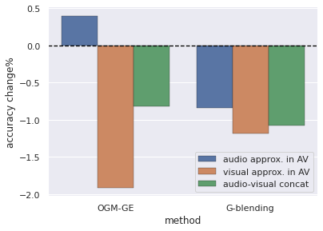
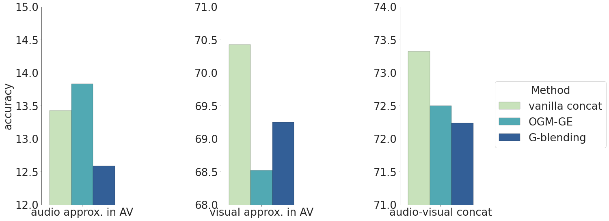
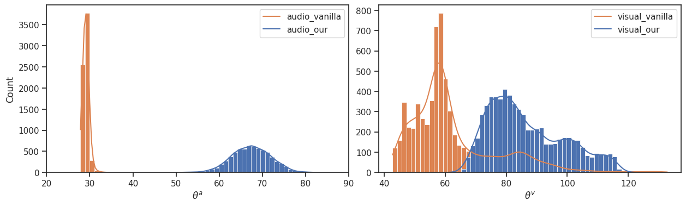
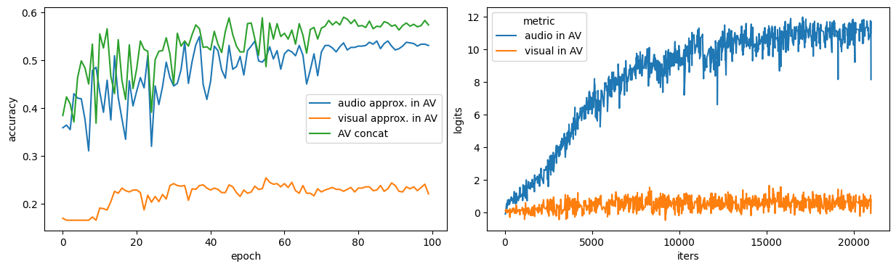
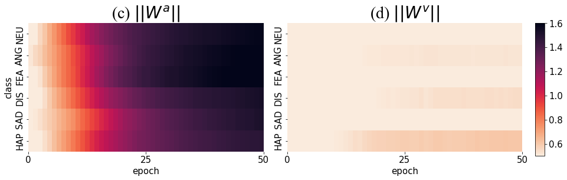

# A cheatbox for Seaborn


```python
import numpy as np
import pandas as pd
import seaborn as sns
import matplotlib.pyplot as plt
```

## Barplot


```python
new= {"accuracy change%":[13.83-13.43,68.52-70.43,72.50-73.32,12.59-13.43,69.25-70.43,72.24-73.32,],
"method":["OGM-GE","OGM-GE","OGM-GE","G-blending","G-blending","G-blending"],
"metric":["audio approx. in AV","visual approx. in AV","audio-visual concat","audio approx. in AV","visual approx. in AV","audio-visual concat"]}
new_data=pd.DataFrame(new)
```


```python
sns.set()

graph=sns.catplot(data=new_data,x="method",y="accuracy change%",hue="metric",kind="bar", palette="deep",legend=False,linewidth=0.3,edgecolor=".1")
# plt.gca().legend().set_title('')
# plt.legend(loc=0)
# handles, labels = ax.get_legend_handles_labels()
# ax.legend(handles=handles[1:], labels=labels[1:])
graph.map(plt.axhline, y=0, color='black', linestyle='dashed',lw=1.3)
plt.gcf().set_size_inches(6, 4)
plt.legend(loc='best')

plt.savefig("teaser.pdf",bbox_inches = 'tight' )

```





```python


data=pd.DataFrame({"accuracy":[13.43,13.83,12.59,70.43,68.52,69.25,73.32,72.50,72.24],"metric":["audio approx. in AV","audio approx. in AV","audio approx. in AV",
"visual approx. in AV","visual approx. in AV","visual approx. in AV","audio-visual concat","audio-visual concat","audio-visual concat"],"Method":["vanilla concat","OGM-GE","G-blending","vanilla concat","OGM-GE","G-blending","vanilla concat","OGM-GE","G-blending"]})
```


```python
sns.set_style("white")
sns.set_style("ticks")
color_set="YlGnBu"
#PuBu
fig, axes = plt.subplots(1, 3,figsize=(14, 9), )#constrained_layout=True
plt.rcParams.update({"font.size":26})
ax1=sns.barplot(data=data[data["metric"]=="audio approx. in AV"],x="metric",y="accuracy",hue="Method", palette=color_set,linewidth=0.3,edgecolor=".1",ax = axes[0],)
sns.despine()
ax2=sns.barplot(data=data[data["metric"]=="visual approx. in AV"],x="metric",y="accuracy",hue="Method", palette=color_set,linewidth=0.3,edgecolor=".1",ax = axes[1])
ax3= sns.barplot(data=data[data["metric"]=="audio-visual concat"],x="metric",y="accuracy",hue="Method", palette=color_set,linewidth=0.3,edgecolor=".1",ax = axes[2])
ax1.legend_.remove()
ax1.set_xlabel("")
ax2.legend_.remove()
ax2.set_xlabel("")
ax2.set_ylabel("")
ax3.legend_.remove()
ax3.set_xlabel("")
ax3.set_ylabel("")
axes[0].set_ylim(ymin=12,ymax=15)

axes[1].set_ylim(ymin=68,ymax=71)

axes[2].set_ylim(ymin=71,ymax=74)
# axes[0].set_title("First")
# axes[1].set_title("Second")
lines, labels=fig.axes[0].get_legend_handles_labels()#
plt.subplots_adjust(wspace=1.2)

l=plt.legend(lines, labels, bbox_to_anchor=(1.1, 0.65),title="Method")
# l2=plt.legend([], [], bbox_to_anchor=(-2.5, 0.65),title="")
fig.subplots_adjust(right=1.2)

fig.savefig("teaser3.pdf",dpi=500,bbox_extra_artists=[l],bbox_inches="tight") #,

#plt.legend(["vanilla concat", "OGM-GE","G-blending"])
```





## Distplot


```python
data_1=pd.read_csv("cosine_dataFalse.csv")

data_2=pd.read_csv("cosine_dataTrue.csv")
```


```python
cos_a_vani=pd.DataFrame(columns=["theta_a value","method"])
cos_a_vani["theta_a value"]=data_1["cosa"]
cos_a_vani["method"]=["audio_vanilla"]*6695

cos_a_mm=pd.DataFrame(columns=["theta_a value","method"])
cos_a_mm["theta_a value"]=data_2["cosa"]
cos_a_mm["method"]=["audio_our"]*6695

cos_v_vani=pd.DataFrame(columns=["theta_v value","method"])
cos_v_vani["theta_v value"]=data_1["cos_v"]
cos_v_vani["method"]=["visual_vanilla"]*6695
```


```python
cos_v_mm=pd.DataFrame(columns=["theta_v value","method"])
cos_v_mm["theta_v value"]=data_2["cos_v"]
cos_v_mm["method"]=["visual_our"]*6695

from cmath import pi
cos_a=pd.concat([cos_a_vani,cos_a_mm],axis=0,ignore_index=True)
cos_a["theta_a value"]=cos_a["theta_a value"].map(lambda x:np.arccos(x)*180/pi)
cos_v=pd.concat([cos_v_vani,cos_v_mm],axis=0,ignore_index=True)
cos_v["theta_v value"]=cos_v["theta_v value"].map(lambda x:np.arccos(x)*180/pi)
```


```python

```


```python
# sns.set()
# sns.set_style("white")
# sns.set_style("ticks")
color_set="deep"
fig, axes = plt.subplots(1, 2,figsize=(15, 4), )#constrained_layout=True

ax2=sns.histplot(data=cos_a,x="theta_a value",hue='method',kde=True,palette=color_set,bins=80,multiple="layer",ax=axes[0],alpha=1)
ax2.legend(["audio_vanilla","audio_our"])
axes[0].set_xlim(xmin=20,xmax=90)
ax2.set_xlabel(r"$ \theta ^a$")
ax1=sns.histplot(data=cos_v,x="theta_v value",hue='method',kde=True,palette=color_set, bins=60,multiple="layer",ax=axes[1],alpha=1)
ax1.legend(["visual_vanilla","visual_our"])
ax1.set_ylabel("")
ax1.set_xlabel(r"$ \theta ^v$")
plt.subplots_adjust(wspace=0.1)
fig.savefig("theta.pdf",dpi=500,bbox_inches="tight")
```





## Performance lineplot


```python
acc_a=pd.read_csv("vani_acc_a.csv")
acc_new_a=pd.DataFrame(columns=["accuracy","metric","epoch"])
acc_new_a["accuracy"]=acc_a["Value"]
acc_new_a["epoch"]=acc_a["Step"]
acc_new_a["metric"]=["audio approx. in AV"]*len(acc_a)

acc_v=pd.read_csv("vani_acc_v.csv")
acc_new_v=pd.DataFrame(columns=["accuracy","metric","epoch"])
acc_new_v["accuracy"]=acc_v["Value"]
acc_new_v["epoch"]=acc_v["Step"]
acc_new_v["metric"]=["visual approx. in AV"]*len(acc_v)

acc_t=pd.read_csv("vani_acc_t.csv")
acc_new_t=pd.DataFrame(columns=["accuracy","metric","epoch"])
acc_new_t["accuracy"]=acc_t["Value"]
acc_new_t["epoch"]=acc_t["Step"]
acc_new_t["metric"]=["audio-visual concat"]*len(acc_t)

acc_all=pd.concat([acc_new_a,acc_new_v,acc_new_t],axis=0,ignore_index=True)

logit_a=pd.read_csv("vani_logits_a.csv")
logit_new_a=pd.DataFrame(columns=["accuracy","metric","iters"])
logit_new_a["logits"]=logit_a["Value"]
logit_new_a["iters"]=logit_a["Step"]
logit_new_a["metric"]=["audio in AV"]*len(logit_new_a)
logit_v=pd.read_csv("vani_logits_v.csv")
logit_new_v=pd.DataFrame(columns=["accuracy","metric","iters"])
logit_new_v["logits"]=logit_v["Value"]
logit_new_v["iters"]=logit_v["Step"]
logit_new_v["metric"]=["visual in AV"]*len(logit_new_v)

logit_all=pd.concat([logit_new_a,logit_new_v],axis=0,ignore_index=True)
```


```python

plt.rcParams.update(plt.rcParamsDefault)

color_set="deep"
fig, axes = plt.subplots(1, 2,figsize=(15, 4), )#constrained_layout=True

ax1=sns.lineplot(data=acc_all,x="epoch",y="accuracy",hue="metric",ax=axes[0])
ax1.legend(["audio approx. in AV","visual approx. in AV","AV concat"])


ax2=sns.lineplot(data=logit_all,x="iters",y="logits",hue='metric',ax=axes[1])
#ax2.legend(["visual_vanilla","visual_our"])
plt.subplots_adjust(wspace=0.1)
fig.savefig("performance.pdf",dpi=500,bbox_inches="tight")
```





# Weight norm heatmap


```python
weight_norm_a=pd.read_csv("weight_norm_a.csv")

all=pd.DataFrame(columns=["epoch","class","value"])
for i in ["HAP",'SAD','DIS',"NEU","FEA","ANG"]:
    t=pd.DataFrame(columns=["epoch","class","value"])
    t["value"]=weight_norm_a.iloc[:50,:][i]
    t["epoch"]=[j for j in range(0,50)]
    t["class"]=i
    all=pd.concat([all,t],ignore_index=True,axis=0)
all=all.pivot_table(index='epoch',columns="class",values="value")

sns.heatmap(all.transpose().reindex(["NEU","ANG","FEA","DIS","SAD","HAP",]),cmap="rocket_r",vmin=0.5,vmax=1.6)


weight_norm_v=pd.read_csv("weight_norm_v.csv")

all_v=pd.DataFrame(columns=["epoch","class","value"])
for i in ["HAP",'SAD','DIS',"NEU","FEA","ANG"]:
    t=pd.DataFrame(columns=["epoch","class","value"])
    t["value"]=weight_norm_v.iloc[:50,:][i]
    t["epoch"]=[j for j in range(0,50)]
    t["class"]=i
    all_v=pd.concat([all_v,t],ignore_index=True,axis=0)
all_v=all_v.pivot_table(index='epoch',columns="class",values="value")

sns.heatmap(all_v.transpose().reindex(["NEU","ANG","FEA","DIS","SAD","HAP"]),cmap="rocket_r",vmin=0.5,vmax=1.6)
```


```python
plt.rcParams.update({"font.size":15})
font_dict=dict(fontsize=28,
              color='black',
              family='Times New Roman',
              weight='normal'
              )
fig, axes = plt.subplots(1, 2,figsize=(15, 4), )#constrained_layout=True


ax1=sns.heatmap(all.transpose().reindex(["NEU","ANG","FEA","DIS","SAD","HAP"]),cmap="rocket_r",vmin=0.5,vmax=1.6,ax=axes[0],cbar=False)

# ax1.set_xticklabels(, rotation=-90)
ax1.set_xticks([0,25,50])
ax1.set_xticklabels(["0","25","50"])
ax1.set_title("(c) $||W^a||$",fontdict=font_dict,)

ax2=sns.heatmap(all_v.transpose().reindex(["NEU","ANG","FEA","DIS","SAD","HAP"]),cmap="rocket_r",vmin=0.5,vmax=1.6,ax=axes[1],cbar=False)

# ax1.set_xticklabels(, rotation=-90)
ax2.set_ylabel("")
ax2.set_xticks([0,25,50])
ax2.set_xticklabels(["0","25","50"])
ax2.set_title("(d) $||W^v||$",fontdict=font_dict,)
plt.subplots_adjust(wspace=0.1)

fig.subplots_adjust(right=0.9)
position = fig.add_axes([0.92, 0.10, 0.015, .78 ])#位置[左,下,右,上]

cb = fig.colorbar(axes[1].collections[0], cax=position)
fig.savefig("weight_norm.pdf",dpi=500,bbox_inches="tight")

```





```python

```
